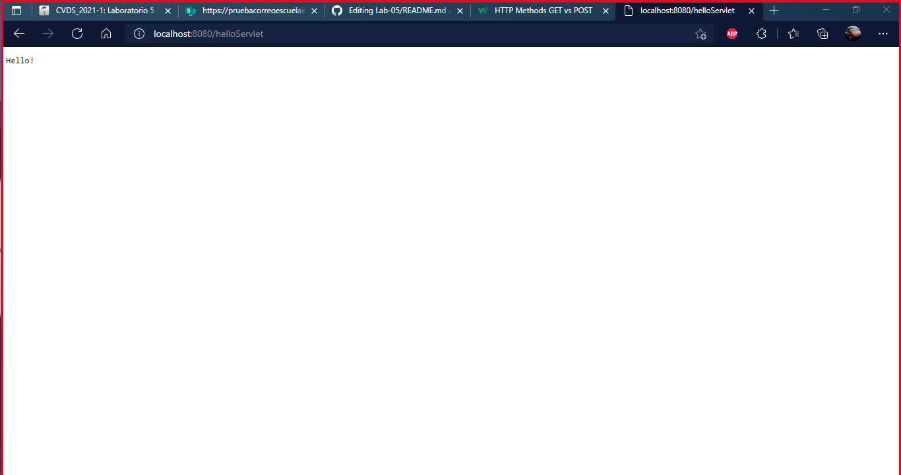
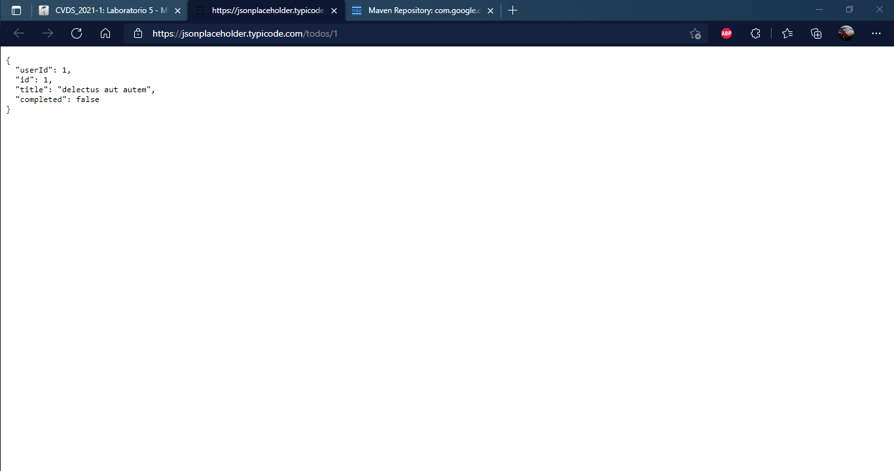
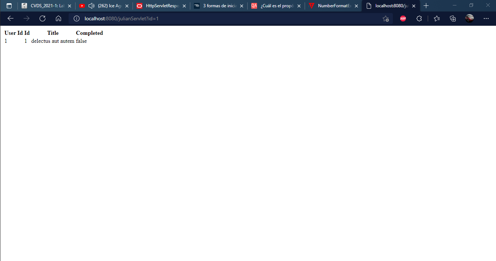
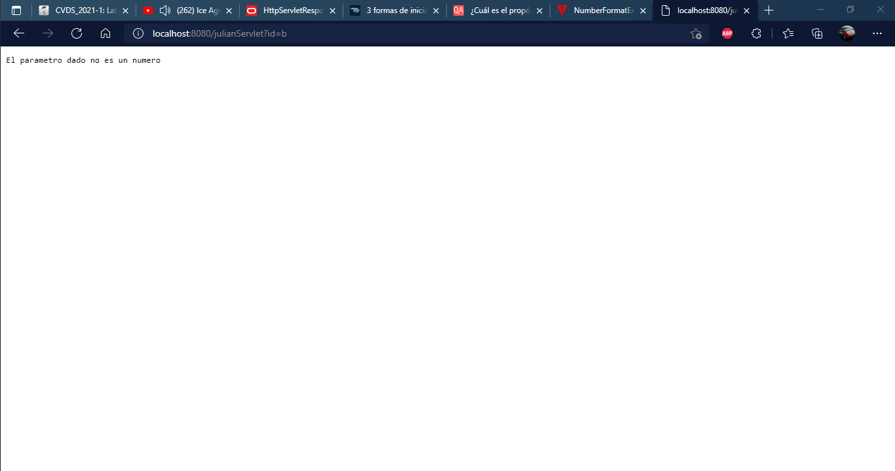

# PARTE UNO
3. Antes de que el servidor cierre la conexión por falta de comunicación:
Revise la página 36 del RFC del protocolo HTTP, sobre cómo realizar una petición GET. Con esto, solicite al servidor el recurso ‘sssss/abc.html’, usando la versión 1.0 de HTTP.
Asegúrese de presionar ENTER dos veces después de ingresar el comando.
Revise el resultado obtenido. ¿Qué codigo de error sale?, revise el significado del mismo en la lista de códigos de estado HTTP.

**Error 301: Se refiere a un error de tipo REDIRECCIONAMIENTO utilizando la version HTTP 1.0** 
**Resultado**
~~~
HTTP/1.1 301 Moved Permanently
Connection: Close 
Date: Thu, 16 Sep 2021 13:54:11 GMT
Server: gunicorn
Location: https://www.escuelaing.edu.co/sssss/abc.html
Content-Type: text/html; charset=utf-8
~~~
¿Qué otros códigos de error existen?, ¿En qué caso se manejarán?

4. Realice una nueva conexión con telnet, esta vez a:
* Host: www.httpbin.org
* Puerto: 80
* Versión HTTP: 1.1
Ahora, solicite (GET) el recurso /html. ¿Qué se obtiene como resultado?

**RESULTADO**
~~~
HTTP/1.1 200 ok 
Date: Tue, 21 Sep 2021 20:24:04 GMT
Content-Type: text/html; charset=utf-8
Content-Length: 3741
Connection: keep-alive
Server: gunicorn/19.9.0
Access-Control-Allow-Origin: *
Access-Control-Allow-Credentials: true
~~~
De igual forma se obtiene como resultado un html, el cual tiene un body, un titulo y un parrafo.

# PARTE DOS
5. Abra un navegador, y en la barra de direcciones ponga la URL con la cual se le enviarán peticiones al ‘SampleServlet’. Tenga en cuenta que la URL tendrá como host ‘localhost’, como puerto, el configurado en el pom.xml y el path debe ser el del Servlet. Debería obtener un mensaje de saludo.

6. Observe que el Servlet ‘SampleServlet’ acepta peticiones GET, y opcionalmente, lee el parámetro ‘name’. Ingrese la misma URL, pero ahora agregando un parámetro GET (si no sabe como hacerlo, revise la documentación en http://www.w3schools.com/tags/ref_httpmethods.asp).

8. En el navegador revise la dirección https://jsonplaceholder.typicode.com/todos/1. Intente cambiando diferentes números al final del path de la url.

15. Intente hacer diferentes consultas desde un navegador Web para probar las diferentes funcionalidades.

